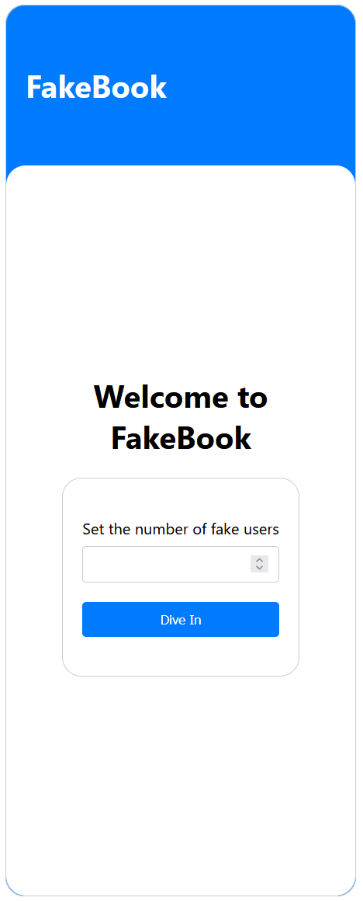
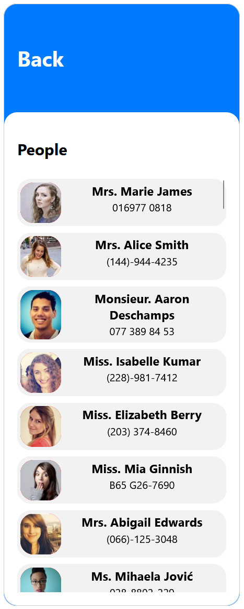
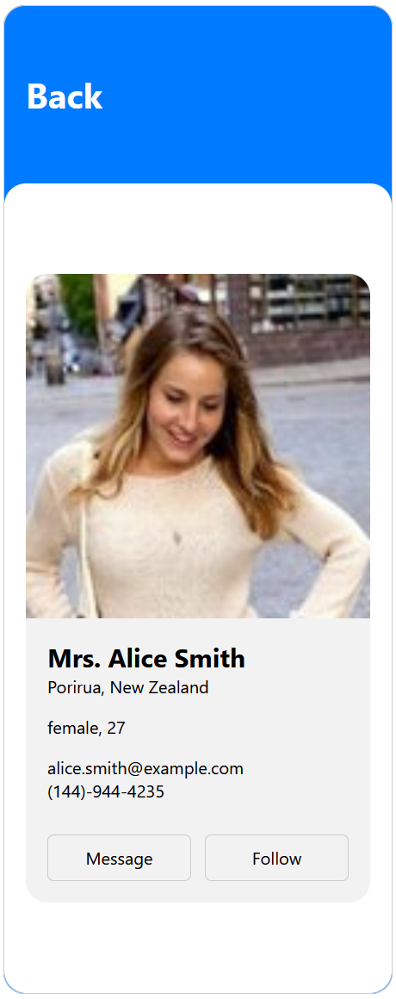

# FakeBook Web App

A dynamic, educational mock-up that simulates social networking experiences, FakeBook is a three-page web app built for instructional purposes. It integrates a fake API to generate user data.

- **Home Page**: Set the scene with a custom number of generated users, ready to populate your fake social network.
- **User List Page**: Scroll through a list of fake profiles, each equipped with a unique identity, created on-the-fly for demonstration.
- **Profile Detail Page**: Dive into the details of a fake person, complete with interactive message and follow buttons to simulate social interactions.

Made for a school project, FakeBook is a great learning app that helps me get the hang of creating websites and using APIs.

## Screenshots

### Home Page

### User List Page

### Profile Detail Page
